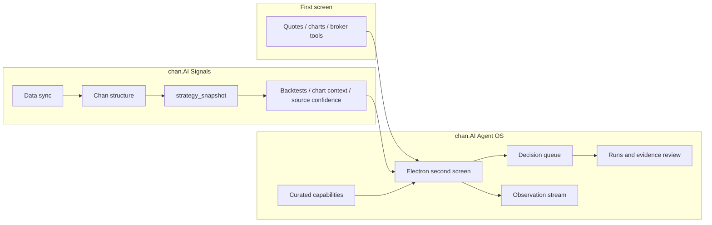
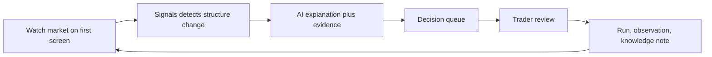

# chan.AI Agent OS


English | [中文](README.zh-CN.md) | [Landing Page](docs/landing/chan-ai/index.html)

chan.AI Agent OS is the local-first workbench for **chan.AI（缠论AI）**, an AI-native trading framework built around Chan-theory signals, AI research, evidence review, and the trader's second screen.

The first screen is still Tonghuashun, Eastmoney, Futu, Bloomberg, TradingView, or your broker terminal. That screen shows the market.

chan.AI Agent OS sits beside it. It turns important market changes into signal candidates, evidence, AI explanations, observations, and reviewable decisions.

## Who It Is For

The first target user is a OnePersonCompany stock trader covering A-shares, Hong Kong stocks, and US equities.

That trader needs a second screen that answers:

- What changed while I was watching the market?
- Which Chan-theory level is active now?
- Which candidates deserve review?
- Which evidence supports or weakens the signal?
- What should be handled intraday, after the close, or later?
- Which research notes should be carried into the knowledge base?

Future scope extends to futures and US equity options, but the core workflow is the same: signal discovery, evidence, AI research, review, and action discipline.

## Product Shape

chan.AI is split into two primary repositories:

| Project | Role |
|---------|------|
| `Signals` | Domain engine. Produces market sync, Chan-theory signals, industry-chain mapping, strategy snapshots, backtests, chart context, and source confidence. |
| `longclaw-agent-os` | Workbench and runtime. Hosts the second-screen UI, decision queue, observations, run review, pack surfaces, local runtime, and capability substrate. |



## What Agent OS Owns

| Area | What it does |
|------|--------------|
| Electron workbench | Desktop surface for Home, Runs, Work Items, Packs, and Studio. |
| Signals pack surface | Fixed professional workbench for market signals, chart context, candidates, warnings, source confidence, and strategy KPIs. |
| Decision queue | Turns signal changes into reviewable trader tasks. |
| Observation stream | Records what the trader or agent observed, what changed, and which evidence was attached. |
| Evidence review | Keeps runs, artifacts, evidence, and review status visible instead of burying them in chat history. |
| Capability substrate | Manages curated skills, plugins, MCP connections, and local runtime capabilities. |
| Local runtime | Provides launchd, guardian, scheduler, local delivery, and recovery flows for a Mac-first setup. |

## What It Does Not Replace

chan.AI Agent OS is not:

- a full-market quote terminal
- a broker client
- a Level 2 entitlement product
- a general charting replacement
- a black-box trading bot
- a generic plugin marketplace homepage

Use the first screen for breadth, licensed depth, and execution. Use chan.AI Agent OS when you need AI-native interpretation, evidence, task flow, and review around the signals that deserve attention.

## Trader Workflow



1. Keep the first-screen terminal open for quotes, charts, and execution.
2. Run Signals data sync and workbench APIs.
3. Open chan.AI Agent OS as the second screen.
4. Review candidates, warnings, chart context, sector/concept movement, and source confidence.
5. Promote important changes into tasks, runs, observations, and reviewed knowledge.

## Quick Start

Clone and launch the desktop workbench:

```bash
git clone https://github.com/Gemini-Nick/longclaw-agent-os.git
cd longclaw-agent-os
bash bootstrap-dev.sh
npm run electron:start
```

Run the full second-screen loop with Signals attached:

```bash
# In ../Signals
bash scripts/bootstrap-dev.sh
bash scripts/python.sh run.py --mode web --port 8011
bash scripts/python.sh run.py --mode web2 --port 6008

# In this repo
export LONGCLAW_SIGNALS_WEB_BASE_URL=http://127.0.0.1:8011
export LONGCLAW_SIGNALS_WEB2_BASE_URL=http://127.0.0.1:6008
npm run electron:start
```

The historical environment variable names still use `LONGCLAW_*` for compatibility. The product brand is now chan.AI.

For an observed product session that starts or attaches to Signals services and opens Electron with observation logging:

```bash
npm run electron:observe
```

## Repository Map

```text
electron/          Desktop workbench, pack surfaces, task flows
src/               Agent SDK substrate and local control-plane client
apps/runtime/      Client runtime assets, launchd, guardian, scheduler
scripts/           Install, observation, runtime, and validation helpers
mcp-servers/       Local MCP services for specialist capabilities
docs/              Architecture, product boundary, UI/UX, landing page, and validation notes
```

## Brand Page

The GitHub landing page draft lives at:

- [docs/landing/chan-ai/index.html](docs/landing/chan-ai/index.html)

Open it directly in a browser or enable GitHub Pages through the included workflow at [.github/workflows/pages.yml](.github/workflows/pages.yml). The page will be available at `/landing/chan-ai/` after Pages is enabled for the repository.

## Documentation

- [Chinese README](README.zh-CN.md)
- [Architecture](docs/ARCHITECTURE.md)
- [Product Boundary](docs/PRODUCT_BOUNDARY.md)
- [Trading Desk UI/UX Guidelines](docs/frontend-uiux-trading-desk-guidelines.md)
- [WeClaw to Client Validation](docs/VALIDATION_WECLAW_TO_CLIENT.md)

## Safety

chan.AI Agent OS is for observation, explanation, research, and review. It does not place trades, route orders, provide investment advice, or guarantee signal profitability. Trading decisions remain the user's responsibility.

## License

No `LICENSE` file is currently included. Add an explicit open-source license before public release or external contribution.
