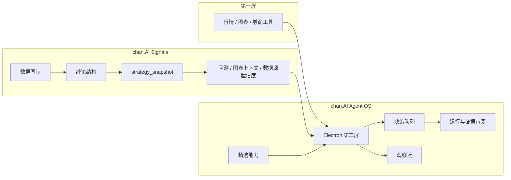
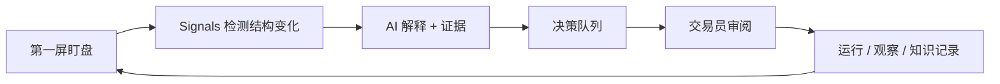

# chan.AI Agent OS


[English](README.md) | 中文 | [Landing Page](docs/landing/chan-ai/index.html)

chan.AI Agent OS 是 **chan.AI（缠论AI）** 的本地优先交易员工作台。chan.AI 是围绕缠论信号、AI 投研、证据审阅和交易员第二屏构建的 AI 原生交易框架。

第一屏仍然是同花顺、东方财富、富途、Bloomberg、TradingView 或券商客户端。第一屏显示市场。

chan.AI Agent OS 放在旁边。它把重要市场变化转成信号候选、证据、AI 解释、观察记录和可审阅决策。

## 目标用户

第一目标用户是覆盖 A股、港股和美股的 OnePersonCompany 股票交易员。

这个交易员需要一个第二屏回答：

- 盘面发生了什么变化？
- 当前生效的缠论级别是什么？
- 哪些候选值得审阅？
- 哪些证据支持或削弱这个信号？
- 哪些任务应该盘中处理、盘后处理，或者延后？
- 哪些投研材料应该进入知识库？

后续会扩展到期货和美股期权，但核心工作流不变：信号挖掘、证据生产、AI 投研、审阅和行动纪律。

## 产品结构

chan.AI 当前由两个核心仓库组成：

| 项目 | 角色 |
|------|------|
| `Signals` | 领域引擎。负责市场同步、缠论信号、产业链映射、策略快照、回测、图表上下文和数据源置信度。 |
| `longclaw-agent-os` | 工作台和运行时。负责第二屏 UI、决策队列、观察流、运行审阅、Pack 表面、本地 runtime 和能力基座。 |



## Agent OS 负责什么

| 区域 | 职责 |
|------|------|
| Electron 工作台 | Home、Runs、Work Items、Packs、Studio 的桌面表面。 |
| Signals Pack 表面 | 市场信号、图表上下文、候选、预警、数据源置信度和策略 KPI 的专业工作台。 |
| 决策队列 | 把信号变化转成交易员可审阅任务。 |
| 观察流 | 记录交易员或 Agent 正在观察什么、发生了什么变化、关联了什么证据。 |
| 证据审阅 | 让运行、产物、证据和审阅状态可见，而不是埋在聊天历史里。 |
| 能力基座 | 管理精选 skills、plugins、MCP 连接和本地 runtime 能力。 |
| 本地运行时 | 提供 launchd、guardian、scheduler、本地投递和恢复流程。 |

## 它不替代什么

chan.AI Agent OS 不是：

- 全市场行情终端
- 券商客户端
- Level 2 授权数据产品
- 通用画图软件
- 黑盒自动交易机器人
- 泛化插件市场首页

第一屏负责广度、授权深度和交易执行。chan.AI Agent OS 负责围绕关键信号做 AI 原生解释、证据、任务流和审阅。

## 交易员工作流



1. 第一屏保持行情、图表和交易执行。
2. 启动 Signals 数据同步和工作台 API。
3. 打开 chan.AI Agent OS 作为第二屏。
4. 审阅候选、预警、图表上下文、板块/概念变化和数据源置信度。
5. 把重要变化晋升为任务、运行、观察记录和 reviewed knowledge。

## 快速开始

克隆并启动桌面工作台：

```bash
git clone https://github.com/Gemini-Nick/longclaw-agent-os.git
cd longclaw-agent-os
bash bootstrap-dev.sh
npm run electron:start
```

连接 Signals 的完整第二屏循环：

```bash
# 在 ../Signals
bash scripts/bootstrap-dev.sh
bash scripts/python.sh run.py --mode web --port 8011
bash scripts/python.sh run.py --mode web2 --port 6008

# 在本仓库
export LONGCLAW_SIGNALS_WEB_BASE_URL=http://127.0.0.1:8011
export LONGCLAW_SIGNALS_WEB2_BASE_URL=http://127.0.0.1:6008
npm run electron:start
```

历史环境变量仍保留 `LONGCLAW_*` 命名以保证兼容；产品品牌改为 chan.AI。

启动带观察日志的产品会话：

```bash
npm run electron:observe
```

## 仓库结构

```text
electron/          桌面工作台、Pack 表面、任务流
src/               Agent SDK 基座和本地 control-plane client
apps/runtime/      Client runtime 资产、launchd、guardian、scheduler
scripts/           安装、观察、运行时和验证脚本
mcp-servers/       专业能力的本地 MCP 服务
docs/              架构、产品边界、UI/UX、landing page 和验证笔记
```

## 品牌页

GitHub landing page 初版位于：

- [docs/landing/chan-ai/index.html](docs/landing/chan-ai/index.html)

可以直接用浏览器打开，也可以启用 [.github/workflows/pages.yml](.github/workflows/pages.yml) 里的 GitHub Pages workflow。仓库启用 Pages 后，页面会通过 `/landing/chan-ai/` 访问。

## 文档

- [English README](README.md)
- [架构](docs/ARCHITECTURE.md)
- [产品边界](docs/PRODUCT_BOUNDARY.md)
- [Trading Desk UI/UX Guidelines](docs/frontend-uiux-trading-desk-guidelines.md)
- [WeClaw to Client Validation](docs/VALIDATION_WECLAW_TO_CLIENT.md)

## 风险声明

chan.AI Agent OS 用于观察、解释、研究和审阅。它不下单、不路由交易、不提供投资建议，也不保证信号收益。最终交易决策由用户自行承担。

## License

当前仓库尚未包含 `LICENSE` 文件。公开发布或接受外部贡献前，应补充明确的开源许可证。
