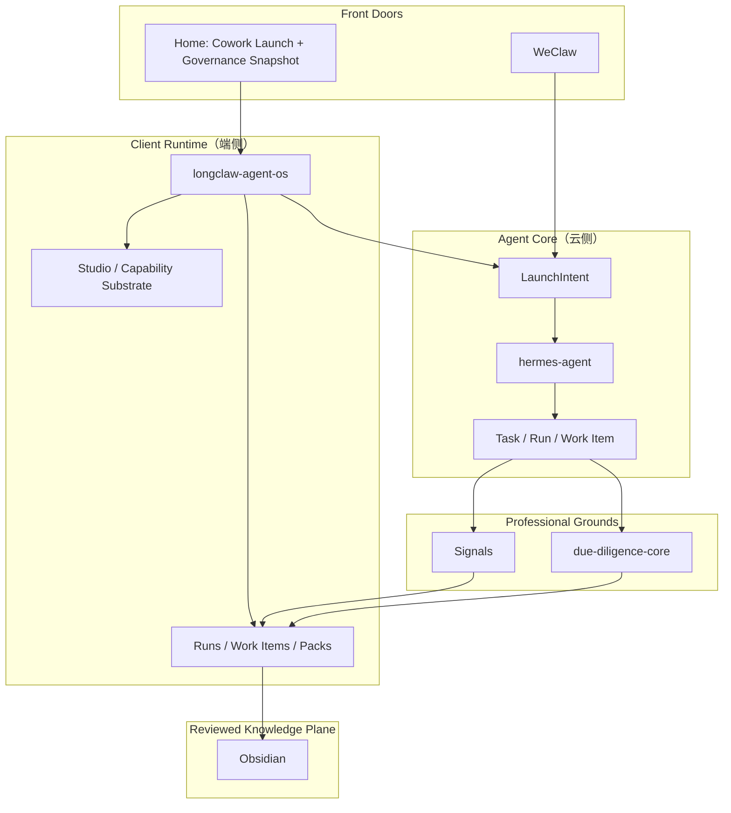

# chan.AI Agent OS Architecture

`chan.AI Agent OS` is the public product brand for this repository.

`longclaw-agent-os` is the current `Client Runtime（端侧）` reference implementation for the chan.AI product line. In phase 1 it is more than an installer shell: it is the default home, the governance surface host, and the local `Capability Substrate` host.

Existing code, environment variables, and older docs may still use `Longclaw` naming for compatibility. Do not rename runtime identifiers unless the migration is planned and tested separately.

It is not the final portable `Agent Core（云侧）`. `hermes-agent` remains the cloud-side core and architecture source of truth.

## Canonical Terms

Use these terms consistently across docs and code reviews:

- `Client Runtime（端侧）`
  - The user-device-side runtime.
  - In phase 1, this repo is the default product home.
- `Agent Core（云侧）`
  - The portable runtime core owned by Hermes.
  - Responsible for `session / memory / skills / scheduler / delivery / approvals / eval`.
- `Interaction Adapter Layer（通道侧）`
  - Channel and protocol adapters such as WeChat and voice.
- `Capability Substrate`
  - The curated capability layer visible from the product shell.
  - Includes `skills / plugins / bundled skills / built-in plugins / cowork runtime`.
- `Professional Grounds`
  - Flagship packs where Longclaw builds specialist depth.
  - In phase 1: `Signals` and `due-diligence-core`.
- `Reviewed Knowledge Plane`
  - Human-readable reviewed knowledge only.
  - In phase 1: `Obsidian`.

## Product Role

This repo owns the default home for Longclaw.

Primary navigation is fixed to:

- `Home`
- `Runs`
- `Work Items`
- `Packs`
- `Studio`

`Home` replaces the old `Overview` and always combines:

- `Cowork Launch`
- `Governance Snapshot`

The product rule here is:

- `Chat launches, console governs.`

That means:

- `Home` gives the operator a fast launch surface.
- governance surfaces remain the system of record for runs, evidence, review, work items, and promotion.
- `Studio` manages curated capabilities, not a plugin marketplace.

## Design Source Of Truth

`longclaw-agent-os` does not own an independent visual language.

- Product-level design decisions come from
  `/Users/zhangqilong/github代码仓库/hermes-agent/docs/longclaw/DESIGN.md`
- This repo implements the primary work surface for that system.
- If a renderer, companion surface, or pack-specific screen wants to diverge,
  it must still preserve Longclaw's shared type system, color semantics,
  surface hierarchy, and status naming.

## System Position

## Responsibilities Owned Here

`longclaw-agent-os` currently owns the device-side host responsibilities:

- install and uninstall flows
- `launchd` orchestration and service packaging
- guardian substrate and recovery flows
- runtime policy injection into `~/.weclaw/config.json`
- `Electron` default home and governance surfaces
- `Studio` and the visible `Capability Substrate`
- local notifications, observability, and reliable local delivery

## Responsibilities That Must Stay In Hermes

Do not migrate these into `longclaw-agent-os`:

- canonical `LaunchIntent`
- canonical `Task / Run / Work Item`
- cross-pack delivery policy
- approvals, promotion, and evaluation gates
- cross-channel session and memory semantics

## Responsibilities That Must Stay In WeClaw

Do not migrate these into `longclaw-agent-os`:

- `VoiceItem.Text` interpretation rules
- voice canonicalization behavior
- media sidecar/session schema
- direct mapping from WeChat message items to canonical agent input
- reviewed handoff compatibility contract
- WeChat protocol semantics

## Integration Boundary With Hermes

`longclaw-agent-os` should interact with Hermes through canonical product APIs:

- `LaunchIntent` submission from `Home`
- `overview / runs / work-items / pack dashboards / actions`
- run artifacts and review queues

The repo should consume those contracts, not redefine pack state machines.

## Integration Boundary With WeClaw

`longclaw-agent-os` should consume `weclaw` through stable interfaces:

- `weclaw-real` binary lifecycle
- `weclaw` CLI entrypoints
- `~/.weclaw/config.json`
- `~/.weclaw` workspace/session/sidecar artifacts

The `Client Runtime（端侧）` may set policy values such as:

- default agent
- reviewed handoff compatibility enablement
- reviewed handoff write policy
- vault paths
- scheduler cadence
- default voice input mode

The underlying config keys may still use legacy names such as `archive` or `formal write`, but the product narrative should treat them as reviewed handoff controls.

## Flagship Packs

This repo surfaces, but does not own, the flagship `Professional Grounds`:

- `Signals`
  - financial review
  - backtest
  - connector health
  - output artifacts
- `due-diligence-core`
  - cloud execution
  - evidence
  - manual review
  - repair
  - site health

They are deep work surfaces under `Packs`, not alternative homes.
